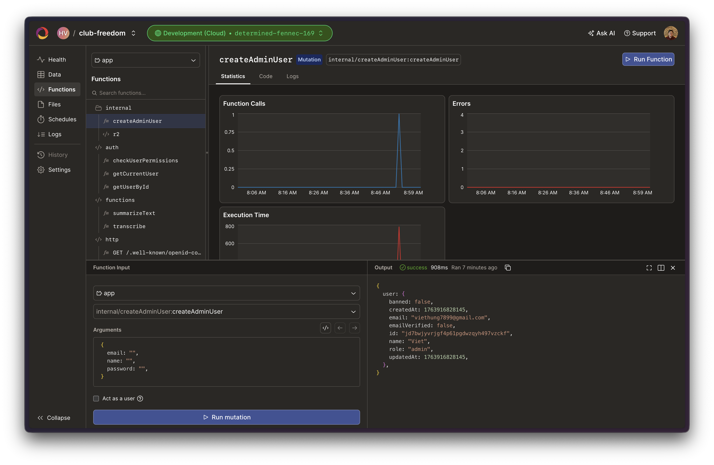

# Getting Started

This guide walks through setting up the Club Freedom Testimonial Platform for local development.

## Prerequisites

- Node.js 20+
- pnpm
- Convex account for the backend
- Cloudflare account for R2 storage
- Google Gemini API key for AI features

## Installation

1. Clone the repository:

   ```bash
   git clone https://github.com/hack-van/for-club-freedom-2025.git
   cd for-club-freedom-2025
   ```

2. Install dependencies:

   ```bash
   pnpm install
   ```

3. Configure environment variables. Most of the setup involves creating the required accounts and storing your personal keys:

   1. Setting up [Better Auth](./configuration.md#better-auth)
   2. Setting up [Resend](./configuration.md#resend)
   3. Setting up [R2 for Convex](https://www.convex.dev/components/cloudflare-r2#cloudflare-account)
   4. Configuring [Cloudflare Turnstile](./configuration.md#cloudflare-turnstile)
   5. Configuring [Posthog](./configuration.md#posthog)
   6. Populating local environment files

4. Set up local domains and HTTPS (see the [Local Domains and HTTPS](./configuration.md#local-domains-and-https-setup) guide).

5. Run the development servers. You can start the Vite frontend and Convex backend in separate terminals:

   ```bash
   # Vite dev server
   pnpm vite dev

   # Convex sync engine
   pnpm convex dev
   ```

   Or run both concurrently:

   ```bash
   pnpm dev
   ```

Visit [https://localhost:3000](https://localhost:3000) to verify the app loads. If you encounter a 500 Internal Server Error after connecting, temporarily try another developer's Convex environment keys and then replace them incrementally with your own to identify the problematic value. Ensure your local `convex/.env.local` matches the Cloud Convex environment variables for your environment. The local React app must run at `https://localhost:3000` so browser APIs for camera and audio are available.

## Setting Up Better Auth with Convex

1. Run `pnpm install` to ensure dependencies are installed.
2. Create the `BETTER_AUTH_SECRET` environment variable in your Convex environment:

   ```bash
   npx convex env set BETTER_AUTH_SECRET=$(openssl rand -base64 32)
   ```

3. Add your site URL to Convex:

   ```bash
   npx convex env set SITE_URL https://localhost:3000
   ```

   Use your production site URL in the production environment.

4. Set `VITE_CONVEX_SITE_URL` in your local `.env` file.

Refer to the [Better Auth guide](https://convex-better-auth.netlify.app/framework-guides/tanstack-start) for more background. Whenever you modify the Better Auth schemas or components, regenerate types with:

```bash
pnpm auth:generate
```

Better Auth tables are visible under the Better Auth component in the Convex dashboard.


## Setting Up Resend

We use [Resend](https://resend.com) to send transactional emails.

1. Register for a Resend account.
2. Generate an API key.
3. Verify your domain.
4. Set the `RESEND_API_KEY` environment variable in Convex with the API key value.

Follow the [Convex Resend component instructions](https://www.convex.dev/components/resend) for detailed setup. A verified domain improves deliverability.

## Creating the First Admin User

Create the first admin through the Convex dashboard:

1. Open the `createAdminUser` function.
2. Click **Run Function**.
3. Provide the name, email, and password.
4. Execute the mutation.



Then manually set the user's role in the `betterAuth.users` table.


## Setting Up R2 for Convex

Follow the _Cloudflare Account_ section in the [Convex R2 documentation](https://www.convex.dev/components/cloudflare-r2#cloudflare-account) to connect R2 to Convex.
